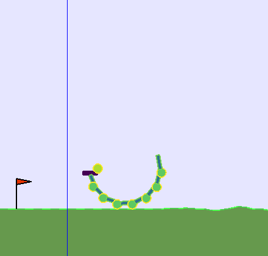

# Robotics, Evolution and Modularity (REM) 2D

This package implements an environment for a modular morphological evolution approach for 2D virtual creatures for
[`openai-gym`](https://gym.openai.com/).
The environment in this package is an adaptation of the [`bipedal walker environment`](https://github.com/openai/gym/blob/master/gym/envs/box2d/bipedal_walker.py).

See [`our paper`](https://www.mitpressjournals.org/doi/abs/10.1162/isal_a_00295) for more information on the project. You can use the following bibtex to cite the project in your publication:

    @article{doi:10.1162/isal\_a\_00295,
    author = {Veenstra, Frank and Glette, Kyrre},
    title = {How Different Encodings Affect Performance and Diversification when Evolving the Morphology and Control of 2D Virtual Creatures},
    journal = {Artificial Life Conference Proceedings},
    volume = {},
    number = {32},
    pages = {592-601},
    year = {2020},
    doi = {10.1162/isal\_a\_00295},
    URL = { 
        https://www.mitpressjournals.org/doi/abs/10.1162/isal_a_00295
    
    },
    eprint = { 
        https://www.mitpressjournals.org/doi/pdf/10.1162/isal_a_00295
    }
    }

A similar 3D modular environment that uses a direct encoding can be found [`here`](https://github.uio.no/jorgehn/gym-rem). We are working on a framework that allows us to use the same encodings to evolve both 2D and 3D modular robots. Stay tuned. 

## Background information

This project has been created to investigate how different type of encoding strategies (or genotype-to-phenotype mappings) can be used to create and use evolutionary algorithms to evolve 2D virtual creatures. Four types of encodings have been used to create the virtual creatures that each have a lot of tunable parameters: A direct encoding, and three types of generative encodings. The generative encodings use are an L-System, a compositional pattern producing network (CPPN) and a cellular encoding. A direct encoding contains all the information necessary for creating all the components of the robot. The generative encodings are recursively called and thereby reuse genetic information. Therefore, direct encodings allow for a more tunable robot that don't change much when mutated, whereas changes in the direct encoding can lead to drastic changes in the robot's phenotype. [`See our paper for more information on the project`](https://www.mitpressjournals.org/doi/abs/10.1162/isal_a_00295).

The image below shows a virtual creature generated by the L-System. The colors of the components represent the 'symbols' from which the genetic information of a particular component is derived. Similarly colored components were expressed by the same genetic information. 



## Example

Here is an example code snippet from one of the demo scripts to create a random individual using a specific encoding

```python
if __name__=="__main__":
    # Change the encoding by altering the argument passed to the random function
    n_iterations = 200 
    for i in range(n_iterations):
        individual = r2d.Individual.random(encoding = 'lsystem') # options: direct, cppn, ce, lsystem
        evaluate(individual, headless = False, controller = None)
```


Please don't hesitate to contact me if you'd like some explanation or have a suggestion.
